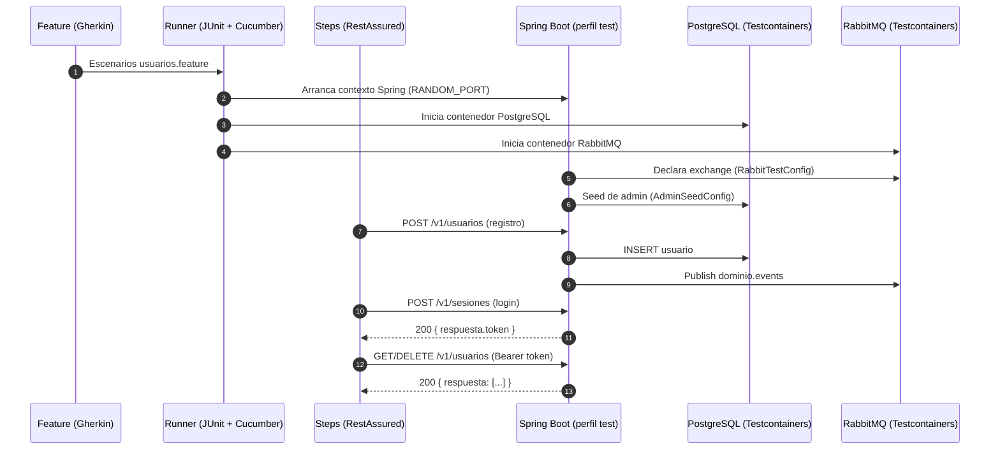

+# Pruebas de aceptación con Cucumber, Spring Boot y Testcontainers

Este documento explica cómo se implementaron las pruebas de aceptación del microservicio, por qué se eligió cada herramienta y qué conceptos conviene dominar. Incluye un diagrama para visualizar el flujo end‑to‑end.

## Objetivos
- Validar casos de negocio (registro, login, recuperación y administración) con escenarios Gherkin.
- Ejecutar la aplicación real (contexto Spring) y verificar de extremo a extremo (HTTP → servicios → DB → RabbitMQ).
- Asegurar reproducibilidad en local/CI sin dependencias manuales.

## Herramientas y por qué
- Cucumber (JUnit 5): define escenarios en Gherkin (Dado/Cuando/Entonces) y los ejecuta como pruebas.
- Spring Boot Test: levanta la app real en puerto aleatorio; permite inyectar beans en steps.
- RestAssured: cliente HTTP fluido para testear endpoints.
- Testcontainers (PostgreSQL, RabbitMQ): contenedores efímeros durante los tests; evita levantar servicios manualmente.

## Estructura creada/actualizada
- Feature: `src/test/resources/features/usuarios.feature`
- Runner: `acceptance/runner/CucumberAcceptanceTest.java`
- Config test:
  - `acceptance/config/CucumberSpringConfig.java`
  - `acceptance/config/TestContainersConfig.java`
  - `acceptance/config/RabbitTestConfig.java`
  - `acceptance/config/AdminSeedConfig.java`
- Steps: `acceptance/steps/UsuarioSteps.java`
- Perfil test: `src/test/resources/application-test.properties`
- Dependencias/Ejecución: `pom.xml`

## Conceptos clave
- Escenario de aceptación: comportamiento de negocio verificable end‑to‑end.
- Glue (steps): código Java que implementa los pasos Gherkin (HTTP + asserts).
- Contexto Spring de prueba: app en `RANDOM_PORT` y perfil `test`.
- `@DynamicPropertySource`: inyecta propiedades de Testcontainers a Spring.
- Contrato de respuesta: `MessageDTO { error, respuesta }` → token en `respuesta.token`.
- RabbitMQ test: exchange `dominio.events` declarado para evitar 404.

## Flujo general

## Paso a paso (qué se hizo)
1) `pom.xml`: se agregaron dependencias de Cucumber, RestAssured y Testcontainers; Surefire quedó listo para JUnit Platform.
2) `usuarios.feature`: escenarios de registro, login, recuperación, y @admin (listar/eliminar).
3) Runner `CucumberAcceptanceTest`: configura engine Cucumber, glue y reporte HTML.
4) `CucumberSpringConfig`: `@SpringBootTest(RANDOM_PORT)` + `@ActiveProfiles("test")` e `@Import` de configs.
5) `TestContainersConfig`: arranca PostgreSQL y RabbitMQ, publica `spring.datasource.*` y `spring.rabbitmq.*`.
6) `RabbitTestConfig`: declara `TopicExchange("dominio.events")` con `RabbitAdmin` para que los publish no fallen.
7) `AdminSeedConfig`: crea un usuario `admin` (rol `ADMIN`) si no existe (útil para @admin).
8) `UsuarioSteps`: RestAssured invoca endpoints; token se obtiene en `respuesta.token` y se envía en `Authorization: Bearer ...`; asserts alineados a `respuesta` y estados 200/201.
9) `application-test.properties`: desactiva Flyway y listeners automáticos; lo demás lo provee Testcontainers.

## Ejecución
- Todo: `./mvnw test`
- Reporte: `target/cucumber-report.html`
- Filtrar por tags (ej. solo admin): en el runner, `cucumber.filter.tags="@admin"`.

## Buenas prácticas aplicadas
- Pruebas end‑to‑end contra la app real.
- Entornos aislados reproducibles con Testcontainers.
- Steps alineados al contrato público (usar `respuesta.*`).
- Seed de datos de administración para independencia del entorno.

## Troubleshooting rápido
- 401 en @admin: verificar extracción de `respuesta.token` y envío de `Authorization: Bearer <token>`.
- 404 en Rabbit: asegurar `RabbitTestConfig` y exchange `dominio.events` declarado.
- Docker requerido: Testcontainers necesita Docker ejecutándose.
