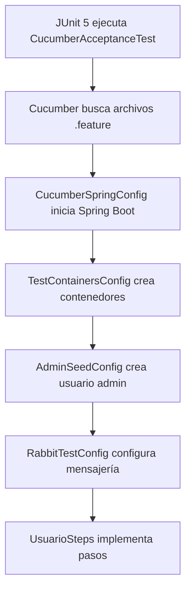
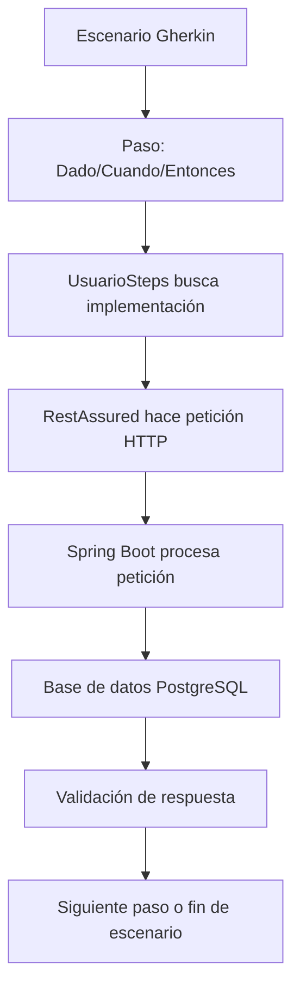

# 🧪 Documentación de Pruebas de Aceptación con Cucumber

## 📋 Índice
1. [Introducción](#introducción)
2. [Arquitectura de Pruebas](#arquitectura-de-pruebas)
3. [Estructura de Archivos](#estructura-de-archivos)
4. [Flujo de Ejecución](#flujo-de-ejecución)
5. [Configuración de Infraestructura](#configuración-de-infraestructura)
6. [Implementación de Pasos](#implementación-de-pasos)
7. [Escenarios de Prueba](#escenarios-de-prueba)
8. [Ejecución de Pruebas](#ejecución-de-pruebas)
9. [Reportes](#reportes)
10. [Troubleshooting](#troubleshooting)

## 🎯 Introducción

Este proyecto implementa pruebas de aceptación usando **Cucumber** con **Spring Boot** y **TestContainers**. Las pruebas simulan el comportamiento real de la aplicación usando infraestructura real (PostgreSQL y RabbitMQ) en contenedores Docker.

### 🏗️ Tecnologías Utilizadas
- **Cucumber**: Framework BDD para pruebas de aceptación
- **Spring Boot Test**: Contexto de aplicación para pruebas
- **TestContainers**: Contenedores Docker para infraestructura
- **RestAssured**: Cliente HTTP para peticiones API
- **DataFaker**: Generación de datos de prueba realistas
- **Hamcrest**: Matchers para validaciones expresivas
- **Allure**: Generación de reportes detallados

## 🏛️ Arquitectura de Pruebas

```
┌─────────────────────────────────────────────────────────────┐
│                    CUCUMBER ACCEPTANCE TESTS                │
├─────────────────────────────────────────────────────────────┤
│  ┌─────────────────┐    ┌─────────────────┐                │
│  │   Feature Files │    │  Step Definitions│                │
│  │   (.feature)    │◄──►│   (UsuarioSteps)│                │
│  └─────────────────┘    └─────────────────┘                │
│           │                       │                        │
│           ▼                       ▼                        │
│  ┌─────────────────────────────────────────────────────────┐│
│  │              SPRING BOOT TEST CONTEXT                  ││
│  │  ┌─────────────┐  ┌─────────────┐  ┌─────────────┐    ││
│  │  │Controllers  │  │  Services   │  │ Repositories│    ││
│  │  └─────────────┘  └─────────────┘  └─────────────┘    ││
│  └─────────────────────────────────────────────────────────┘│
│           │                       │                        │
│           ▼                       ▼                        │
│  ┌─────────────────────────────────────────────────────────┐│
│  │                TESTCONTAINERS                          ││
│  │  ┌─────────────┐              ┌─────────────┐          ││
│  │  │ PostgreSQL  │              │  RabbitMQ   │          ││
│  │  │  Container  │              │  Container  │          ││
│  │  └─────────────┘              └─────────────┘          ││
│  └─────────────────────────────────────────────────────────┘│
└─────────────────────────────────────────────────────────────┘
```

## 📁 Estructura de Archivos

```
src/test/
├── java/com/uniquindio/archmicroserv/jwtgeneratortaller1/acceptance/
│   ├── runner/
│   │   └── CucumberAcceptanceTest.java          # Suite de pruebas JUnit 5
│   ├── steps/
│   │   └── UsuarioSteps.java                    # Implementación de pasos
│   └── config/
│       ├── CucumberSpringConfig.java            # Configuración principal
│       ├── TestContainersConfig.java            # Infraestructura Docker
│       ├── AdminSeedConfig.java                 # Datos de prueba
│       └── RabbitTestConfig.java                # Configuración RabbitMQ
└── resources/
    ├── features/
    │   └── usuarios.feature                     # Escenarios Gherkin
    └── schemas/
        ├── message_dto.schema.json              # Esquema respuestas mensajes
        ├── token_response.schema.json           # Esquema respuestas tokens
        └── usuarios_page.schema.json            # Esquema listas paginadas
```

## 🔄 Flujo de Ejecución

### 1. **Inicialización**


### 2. **Ejecución de Escenarios**


## ⚙️ Configuración de Infraestructura

### **TestContainersConfig.java**
- **PostgreSQL**: Base de datos real para pruebas
- **RabbitMQ**: Sistema de mensajería real
- **Configuración dinámica**: URLs de contenedores se inyectan automáticamente

### **AdminSeedConfig.java**
- **Usuario admin**: Credenciales fijas para pruebas de administración
- **Inicialización automática**: Se crea antes de ejecutar escenarios
- **Evita duplicados**: Solo crea si no existe

### **RabbitTestConfig.java**
- **Exchange de eventos**: Para comunicación entre servicios
- **Configuración automática**: Se declara al iniciar
- **Mensajería real**: No mocks, sino RabbitMQ real

## 🔧 Implementación de Pasos

### **UsuarioSteps.java**
Cada método anotado con `@Dado`, `@Cuando`, `@Entonces` o `@Y` implementa un paso específico:

```java
@Cuando("registro un usuario con datos válidos")
public void registroUsuarioValido() {
    // 1. Generar datos aleatorios
    // 2. Crear JSON
    // 3. Enviar petición POST
    // 4. Guardar respuesta
}
```

### **Características principales:**
- **Datos realistas**: DataFaker genera datos coherentes
- **Estado compartido**: Variables de instancia mantienen contexto
- **Validaciones robustas**: Hamcrest para assertions expresivas
- **Esquemas JSON**: Validación de estructura de respuestas

## 📝 Escenarios de Prueba

### **usuarios.feature**
Define 5 escenarios principales:

1. **Registro de usuario**: Crear nuevo usuario
2. **Autenticación**: Login con credenciales válidas
3. **Recuperación**: Solicitar código de recuperación
4. **Listado (Admin)**: Consultar usuarios con privilegios admin
5. **Eliminación (Admin)**: Eliminar usuario con privilegios admin

### **Tags utilizados:**
- `@admin`: Escenarios que requieren privilegios de administrador

## 🚀 Ejecución de Pruebas

### **Desde IDE**
```bash
# Ejecutar clase específica
CucumberAcceptanceTest.java

# Ejecutar con tags específicos
@admin
```

### **Desde Maven**
```bash
# Ejecutar todas las pruebas
mvn test

# Ejecutar solo pruebas de aceptación
mvn test -Dtest=CucumberAcceptanceTest

# Ejecutar con tags específicos
mvn test -Dcucumber.filter.tags="@admin"
```

### **Desde línea de comandos**
```bash
# Ejecutar con JUnit 5
./mvnw test -Dtest=CucumberAcceptanceTest

# Ejecutar con reportes
./mvnw test -Dtest=CucumberAcceptanceTest -Dcucumber.plugin="pretty,html:target/cucumber-report.html"
```

## 📊 Reportes

### **Formatos disponibles:**
1. **Consola**: Formato `pretty` para lectura fácil
2. **HTML**: `target/cucumber-report.html` para navegador
3. **Allure**: Reportes interactivos y detallados
4. **Resumen**: Estadísticas de ejecución

### **Ubicación de reportes:**
```
target/
├── cucumber-report.html          # Reporte HTML principal
├── allure-results/              # Datos para Allure
└── surefire-reports/            # Reportes JUnit
```

## 🔧 Troubleshooting

### **Problemas comunes:**

#### **1. Contenedores no inician**
```bash
# Verificar Docker
docker --version
docker-compose --version

# Verificar contenedores
docker ps -a
```

#### **2. Puerto ocupado**
```bash
# Verificar puertos en uso
netstat -an | grep :8080
netstat -an | grep :5432
```

#### **3. Base de datos no conecta**
```bash
# Verificar logs de contenedor
docker logs <container_id>

# Verificar configuración
echo $DATASOURCE_URL
```

#### **4. Token JWT inválido**
```bash
# Verificar logs de autenticación
grep -i "token" logs/application.log

# Verificar configuración JWT
grep -i "jwt" src/main/resources/application.properties
```

### **Logs útiles:**
```bash
# Logs de Spring Boot
tail -f logs/application.log

# Logs de contenedores
docker logs jwt_postgres
docker logs jwt_app
```

## 📚 Recursos Adicionales

### **Documentación oficial:**
- [Cucumber Java](https://cucumber.io/docs/cucumber/)
- [Spring Boot Testing](https://spring.io/guides/gs/testing-web/)
- [TestContainers](https://www.testcontainers.org/)
- [RestAssured](https://rest-assured.io/)

### **Ejemplos de uso:**
- Ver `UsuarioSteps.java` para implementación de pasos
- Ver `usuarios.feature` para escenarios Gherkin
- Ver `TestContainersConfig.java` para configuración de infraestructura

---

## 🎉 Conclusión

Esta implementación de pruebas de aceptación proporciona:
- **Cobertura completa** de funcionalidades críticas
- **Infraestructura real** para pruebas confiables
- **Documentación clara** para mantenimiento
- **Reportes detallados** para análisis
- **Fácil ejecución** desde IDE o línea de comandos

Las pruebas garantizan que el sistema funcione correctamente en un entorno que simula la producción, proporcionando confianza en el despliegue y mantenimiento del software.
